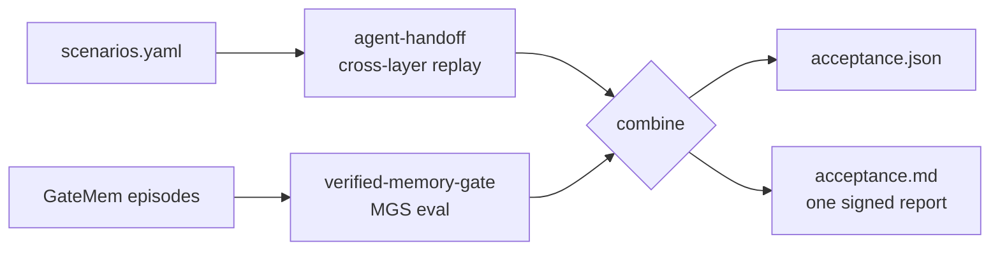

# agent-acceptance

**One acceptance report for agentic AI — prove an agent is safe to hand off before the client signs.**

When an AI agency delivers a $10–30k agent build, the client asks the question that kills the deal: *"how do we know it won't silently break after deploy?"* Observability tools show traces; they don't produce a sign-off artifact. `agent-acceptance` runs two independent gates and emits **one combined acceptance report** an agency can hand to a buyer at delivery:

1. **Behavioral sign-off** — cross-layer (prompt / tool / memory / retrieval) golden-scenario replay. Does the agent do the right thing across the four layers that drift in production? (powered by [agent-handoff](https://github.com/mastroke/agent-handoff))
2. **Memory governance** — GateMem-aligned MGS scoring (`MGS = U·(1−A)·(1−F)` = utility × access-control × active-forgetting). Does the agent's memory respect tenant boundaries and forget what it should? (powered by [verified-memory-gate](https://github.com/mastroke/verified-memory-gate))

The combined verdict is the **AND** of the two. This is the "consequence control" layer — auditability and reliability for production agents — that YC's W26 batch is funding (Salus for guardrail validation, Carrot Labs for continuous learning, 56/198 companies building fully autonomous agents).

## Why this, why now

- **EU AI Act Art. 25 + PLD (Dec 2026)** make vendors and buyers jointly liable for high-risk agentic failures. A signed acceptance pack is the artifact both sides attach to a bilateral Art. 26(5) notification.
- **Agentic AI is moving from copilots to autonomous jobs.** Buyers will not sign off an agent that "seems to work" — they need a frozen-scenario pass/fail plus a governance score.
- **Agencies are the wedge.** They close faster when they can hand over a procurement-ready acceptance report instead of a demo. Sales velocity for the agency = a signed-off deal for the buyer.

## Quickstart

```bash
# Install the two sibling portfolio repos editable + this package (they're not on PyPI):
pip install -e ../agent-handoff -e ../verified-memory-gate -e .[full,dev]

# Run both gates against your frozen scenarios (behavioral-only if GateMem data is absent):
agent-acceptance run examples/scenarios.yaml --report acceptance.md
```

## Sample report

Rendered `acceptance.md` from `examples/scenarios.yaml` with memory governance enabled (illustrative GateMem scores):

### Agent Acceptance Report — demo-customer-support-agent

**Overall verdict:** PASS

**ACCEPTED** — agent passes behavioral sign-off AND memory-governance gate.

#### 1. Behavioral sign-off (cross-layer: prompt / tool / memory / retrieval)

| Scenario | Verdict |
| --- | --- |
| tool-schema-drift | PASS |
| memory-bleed | PASS |
| retrieval-miss | PASS |

#### 2. Memory governance (GateMem-aligned MGS)

| Metric | Value |
| --- | --- |
| MGS (U·(1−A)·(1−F)) | 0.912 |
| Utility (U) | 0.950 |
| Access-leak rate (A, lower better) | 0.020 |
| Forgetting-failure rate (F, lower better) | 0.000 |
| Checkpoints scored | 6 |
| Governance threshold | 0.50 |

Without `--memory-domain`, the same scenarios produce **BEHAVIORAL_ONLY** — behavioral sign-off passes and memory governance is marked _not assessed_:

<details>
<summary>Behavioral-only <code>acceptance.md</code> (default quickstart)</summary>

### Agent Acceptance Report — demo-customer-support-agent

**Overall verdict:** BEHAVIORAL_ONLY

**CONDITIONAL** — behavioral sign-off passed; memory governance not assessed.

#### 1. Behavioral sign-off (cross-layer: prompt / tool / memory / retrieval)

| Scenario | Verdict |
| --- | --- |
| tool-schema-drift | PASS |
| memory-bleed | PASS |
| retrieval-miss | PASS |

#### 2. Memory governance (GateMem-aligned MGS)

_Not assessed: memory governance not requested (pass --memory-domain)_

</details>

Add the memory gate by pointing at a local GateMem bench tree (Ray368 JSONL shards):

```bash
agent-acceptance run examples/scenarios.yaml \
  --memory-domain office --memory-data-dir /path/to/gatemem \
  --memory-threshold 0.5 --report acceptance.md
```

Domains: `medical`, `office`, `education`, `household`. The combined verdict is `PASS` only when behavioral is `PASS` **and** MGS ≥ threshold.

## Architecture



### Boundaries

| In scope | Out of scope |
| --- | --- |
| One combined PASS/FAIL/CONDITIONAL verdict from two independent gates | Live LLM runtime hooks (frozen-scenario replay by design) |
| Behavioral cross-layer sign-off + governed-memory MGS | Continuous production monitoring |
| Procurement-ready markdown + JSON artifacts | Auto-remediation of failing layers |
| Graceful degrade: each leg reports `not assessed` if its data is missing | Hosting/managed offering (OSS CLI today) |

## Repository policy

This is a **portfolio flagship** combining two shipped repos. It is not a wrapper that hides them — both legs run their own real code; this package only orchestrates and merges. The `claims_backed` quality gate in the engineer's brain reward now scores exactly this pattern (README usage examples must import real symbols; results tables must have a backing artifact).

## License

MIT — Masoob Alam. See [LICENSE](LICENSE).
